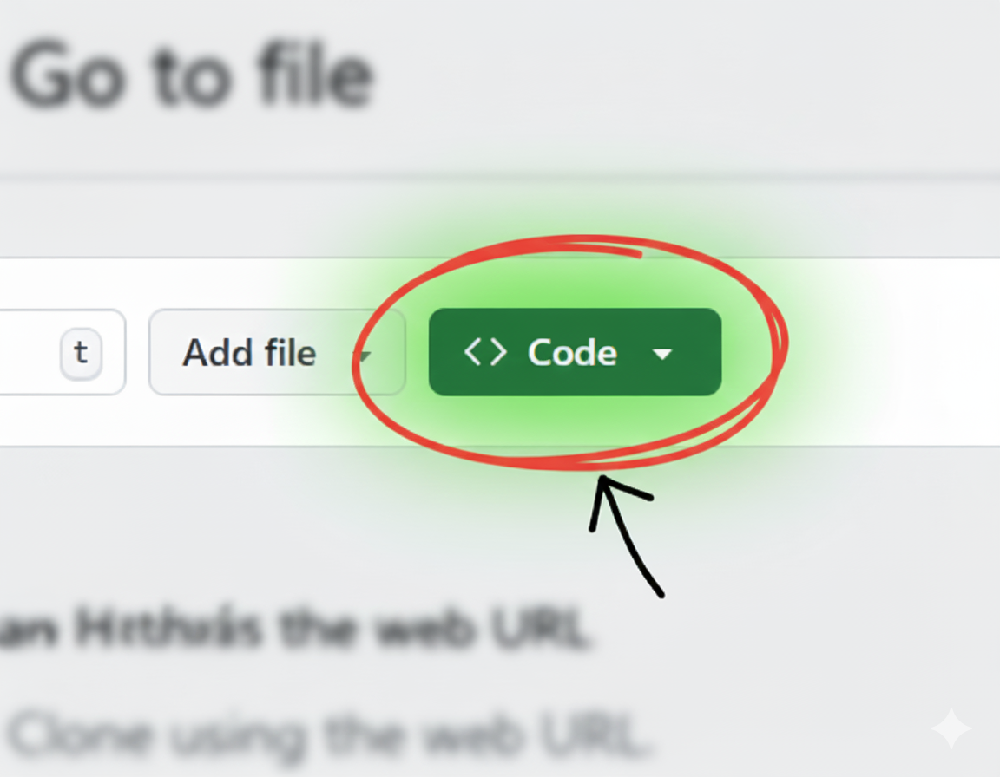

# vs-code-setup
Setup for VS code projects like [Arjan Codes](https://youtu.be/PwGKhvqJCQM?si=iykasikAMq893Uf-)

This is for a VS Code project template that includes a virtual environment  (.venv), default python packages, and some recommended extensions. The template is for Python projects with a focus on data analysis, but can be adapted for other languages.

The .gitignore file is set up to ignore the virtual environment and other common files that should not be committed to the repository. It also includes common R files and folders which should not be pushed to public repos.

## How to use:

Make sure you're logged in to your github account.

Click "Use this template" - Create a new repository.

Give the repo a name and description.
Create the repository - it will be a new repository on your github account.

## Clone the repository
Here you are essentially copying the repo you created from the template onto your local machine, and referencing it as a git repo that is linked to the GitHub repo.

**It's best to avoid putting this on your OneDrive as I have found that sometimes VS Code can't properly access the .venv, possibly due to OneDrive's syncing, or long path names.** Because you are creating a github repo, this will always be backed up, so you don't need OneDrive for that.

copy the URL of the repo from the Code button.



 then go your top level folder where you will do your analysis project in the **terminal** e.g. 
 `C:\Users\steve.crawshaw\projects`

and type 

`git clone <hit CTRL+V to paste the URL>`

## Install uv
(if you've already installed uv you can skip this step)<br>
UV is a helpful tool for managing virtual environments and packages. It can be installed by running this line from powershell:

`powershell -ExecutionPolicy ByPass -c "irm https://astral.sh/uv/install.ps1 | iex"`

## Install packages with uv

We're going to use the [project - based approach](https://docs.astral.sh/uv/guides/projects/#running-commands) to virtual environments, which means that the .venv folder will be created in the project folder. UV uses the pyproject.toml file to track packages, and creates a lock file (uv.lock) to ensure that the exact versions of packages are recorded.

It's good practice (but not essential) to set the name of the virtual environment folder to .venv as this is automatically ignored by git, and is a common convention. UV will do this for you. You need to set windows explorer to show hidden files to see the .venv folder. Don't edit the .venv folder directly.

When the .venv is active in the terminal, you will see its name in brackets at the start of the terminal prompt, e.g. `(.venv) C:\Users\steve.crawshaw\projects\myproject>`. It's a good idea to set this name by changing the name of the project in pyproject.toml.

In the root of your project folder you can type `code pyproject.toml` and manually change the name and description values. Alternatively there is a helper Powershell script you can run from the powershell terminal like this:

`.\update-project.ps1 -Name "my-awesome-project" -Description "This is my awesome project"`

Then when the .venv is active you should see:

`(my-awesome-project) C:\Users\steve.crawshaw\projects\myproject`

Which tells you that the .venv is active, and which project it is for.

Make sure you're in the project folder in the terminal, and with one command you can create the default .venv and install the packages listed in the pyproject.toml file by typing:

`uv sync`

You should see a lot of packages being installed quite quickly.

You can add new packages with `uv add <package>`, e.g. `uv add pandas`. You might need to do this as you develop code, and you get a message saying that a package is missing.

UV looks at the pyproject.toml file to see what packages are listed there, and installs them into the .venv. It also updates the lock file (uv.lock) to ensure that the exact versions of packages are recorded. If your venv becomes corrupted you can simply delete it and use `uv sync` to recreate it. If you get a cryptic message about hardlink failures, you may need to delete the uv.lock file and then run `uv sync` again. If you get a message about cache you can do `uv cache clean`.

Don't forget that **if you are running tools from the command line which are installed in the .venv** you need to activate the virtual environment first, e.g. on Windows Powershell:

```
.\.venv\Scripts\activate
```
on Windows Git bash:
```
source .venv/Scripts/activate
```
on Linux or Mac:
```
source .venv/bin/activate
```
## Selecting the Python interpreter in VS Code

Once the .venv is created, you need to tell VS Code to use the Python interpreter from the .venv. You can do this by opening the command palette (Ctrl+Shift+P) and typing "Python: Select Interpreter". You should see an option that includes ".venv". If you renamed the project in the pyproject.toml file it will be called like (my-project-name) rather than (.venv). Select this option.

You should now be in a position to run Python code in VS Code using the packages installed in the .venv.

You can create a new python file by typing `code new-file.py` from your project folder and start writing code. If you use code fences like `# %%' you will get an [interactive notebook experience](https://code.visualstudio.com/docs/python/jupyter-support-py) where you can run a chunk at a time with CTRL+ENTER or SHIFT+ENTER or run the whole script.

## Extensions
Some recommended extensions are included in .vscode/extensions.json.

Open the command palette (Ctrl+Shift+P) and type "Extensions: Install Extensions". Click the Funnel in the search extension bar and select "Recommended". This will show the extensions listed in .vscode/extensions.json. Click "Install All" to install them.
